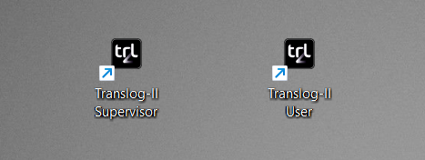
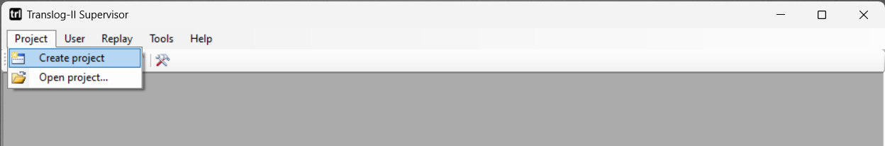
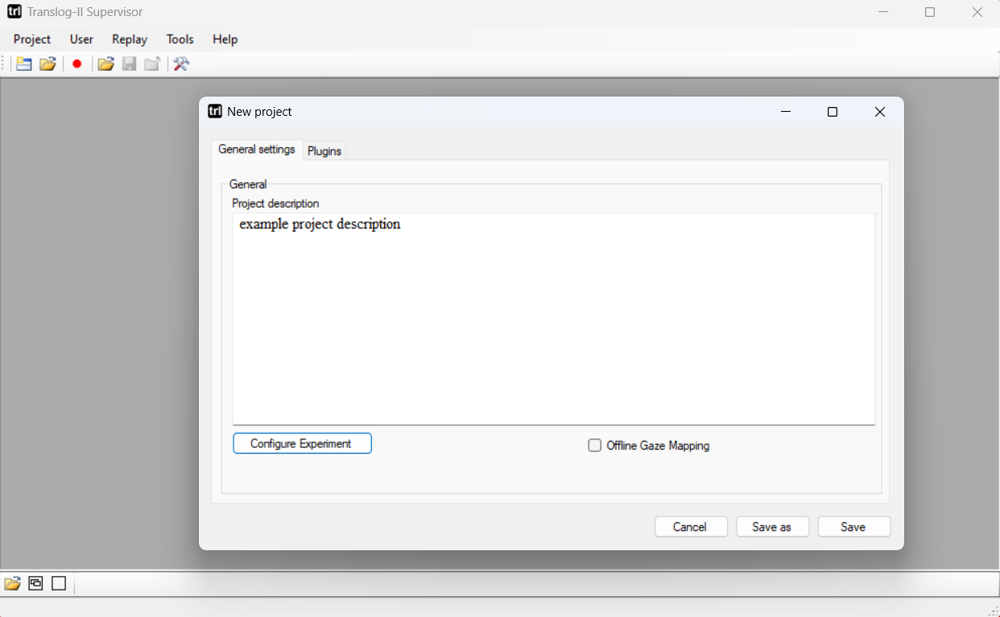
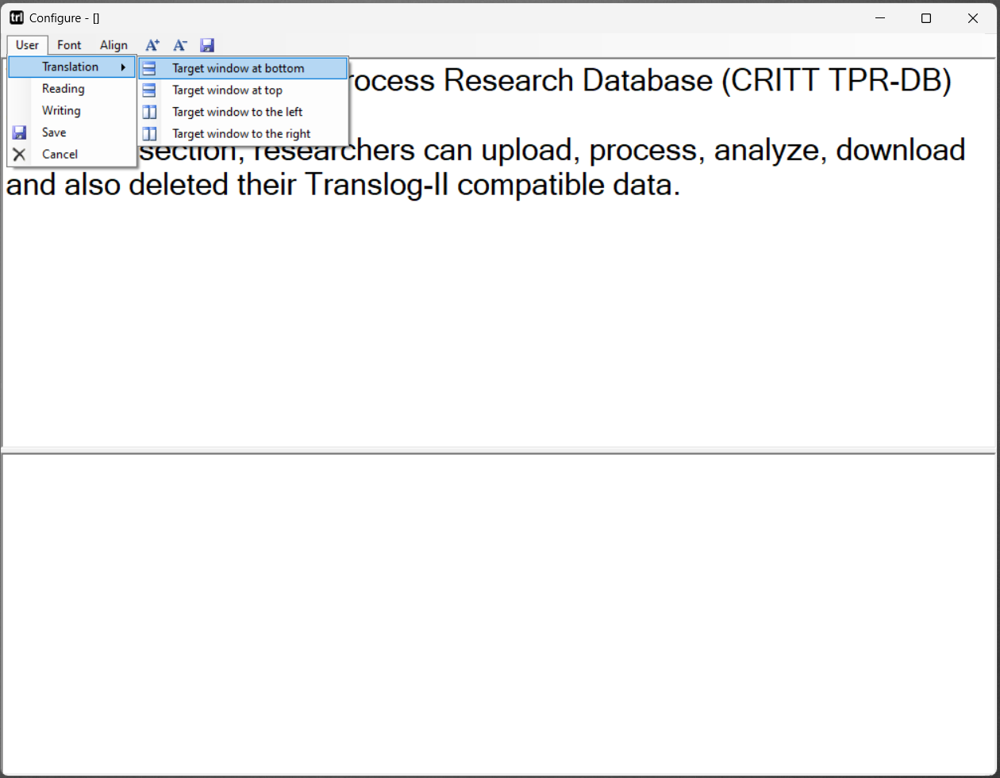
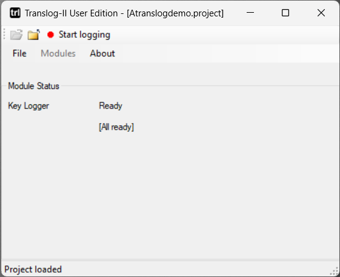
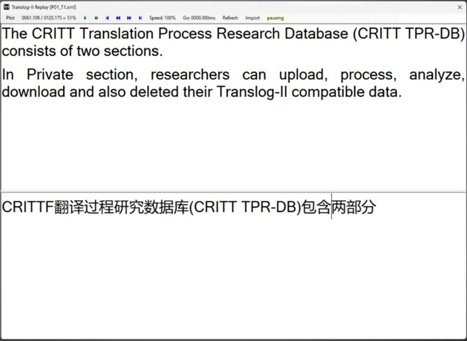

# Conducting Keylogging Experiments with Translog-II

This guide provides a step-by-step walkthrough for using Translog-II to conduct a basic keylogging experiment. It covers the complete workflow — from project configuration to data collection — using an English-to-Chinese translation-from-scratch task as a worked example.

The guide is based on Zou & Carl (2026)[^zoucarl2026].

[^zoucarl2026]: Zou, L., & Carl, M. (2026). Using Translog-II for Conducting Keylogging Experiments. *Data* (forthcoming).

!!! note

    Keylogging with Translog-II is the most accessible entry point for conducting behavioral experiments in translation process research. The software is freely available, and a keylogging experiment requires no specialized hardware beyond a standard Windows computer.

---

## 1. Overview of Translog-II

Translog-II is a specialized tool for recording user activity data (UAD) during translation, writing, and reading tasks. It records keystrokes and, when connected to an eye-tracker, gaze movements during sessions.

### Architecture

Translog-II consists of two main components:

- **Translog-II Supervisor** — used to create project files that define the experimental setup and to replay recorded sessions.
- **Translog-II User** — used to run text production experiments in which a participant reads, writes, or translates a text.



During a session, Translog-II produces log files containing UAD, including keystrokes and (optionally) gaze movements.

### What Translog-II logs

Translog-II classifies keystroke data into several categories:

| Category | Description |
|---|---|
| Insertion | Characters typed into the text |
| Deletion | Via the Delete and Backspace keys |
| Navigation | Cursor movements (arrow keys, Home, End, etc.) |
| Copy/Cut-and-paste | Clipboard operations |
| Return | The Return/Enter key |
| Mouse operations | Mouse clicks and selections |
| IME | Input Method Editor events (for logographic scripts such as Chinese and Japanese) |

For each keystroke event, Translog-II records the event type, the value of the keystroke, the cursor position, and the timestamp in milliseconds.

!!! note

    The keylogger runs in the background and does not interfere with the writing or translation process. Translog-II logs the exact time at which each **keydown** event occurs.

---

## 2. Setting Up an Experiment

Translog-II provides three main functions for conducting experiments: project creation, session recording, and replay/analysis.

### Step 1 — Create a project

1. Open **Translog-II Supervisor**.
2. Select **Project → Create Project**.



3. In the "New Project" dialogue box, click **Configure Experiment** to define the experimental parameters.



A project file can be configured for different experimental setups:

| Setup | Source window | Target window |
|---|---|---|
| Reading experiment | Visible | Hidden |
| Writing experiment | Hidden | Visible |
| Translation experiment | Visible | Visible |
| Post-editing experiment | Visible | Visible (pre-filled with MT output) |

The source and target windows can be oriented horizontally or vertically and positioned left-right or top-bottom.

!!! note

    For language pairs requiring an IME (such as Chinese and Japanese), check the **"Offline Gaze Mapping"** box if an eye-tracker is connected. This ensures proper mapping of alphabetic letters typed on the keyboard to the corresponding logographic characters displayed on screen.

### Step 2 — Configure the experiment

For our English-to-Chinese example:

1. Enter the English source sentences into the upper window.
2. Select **Translation** and **Target window at bottom**.
3. Leave the bottom window empty for the participant's translation.
4. Adjust font (sans-serif is recommended), text alignment, and layout as needed.
5. Save the configuration as a `.project` file.



!!! tip

    The `.project` file can be reused for all participants translating the same source text.

### Step 3 — Record a session

1. Open the `.project` file in **Translog-II User**.
2. Click **Start Logging** to begin the session. This opens the configured interface displaying the source text and an empty target window.
3. The participant translates the text.
4. When the participant finishes, click **Stop Logging**. The session is saved as an XML file.



!!! warning

    To facilitate later processing with the CRITT TPR-DB, name the file using the TPR-DB naming convention. For example, `P01_T1`, where `P01` identifies the participant and `T1` indicates a translation-from-scratch task with source text 1. See the [TPR-DB naming conventions](https://sites.google.com/site/centretranslationinnovation/tpr-db/uploading?authuser=0#h.p_ID_175) for details.

### Step 4 — Replay and analyze (optional)

Translog-II includes a replay tool with three visualization modes:

- **User view** — Real-time replay of the logged data, showing typing activity as it occurred. Playback controls allow researchers to accelerate, decelerate, pause, rewind, or fast-forward.
- **Linear view** — Displays each key and mouse activity in a linear textual sequence. Pauses between successive actions are shown as asterisks or numeric values. The pause granularity can be adjusted from 1ms upward.
- **Pause plot** — A 2D graph where keyboard activities appear on the X-axis and accumulated time (pauses) on the Y-axis.

All three views can be opened simultaneously and synchronized so the cursor in all windows is positioned at the same point in time.



!!! warning

    The user view and linear view do not function reliably with gaze data, and their statistical outputs may be inaccurate when eye-tracking information is included. For precise analysis involving gaze data, upload the log files to the CRITT TPR-DB and use the generated tables instead.

### Next steps: Processing your data

The logged data collected by Translog-II can be uploaded to the [CRITT Translation Process Research Database (TPR-DB)](https://sites.google.com/site/centretranslationinnovation/tpr-db) for post-processing and analysis. See the [Automatic Processing](https://critt-kent.github.io/TPR-DB-documentation/process/automatic-processing/) documentation for details.

---

## 3. Tips for IME-Mediated Translation Experiments

When conducting experiments with languages that require IMEs (Chinese, Japanese, Korean, etc.), keep the following in mind:

- **Review longer deletions manually** — the automated keystroke-to-word mapping heuristic becomes less reliable as deletion length increases, particularly for multi-word IME conversions. Use the TPR-DB's semi-automatic adjustment tool if precise deletion analysis is needed.
- **Be aware of timing ambiguity** — for IME input, there are at least two possible measures of production time: the duration of the keystrokes typed, and the time until the character appears on screen. The delay between triggering IME conversion and character appearance reflects both technical processing time and the time the typist spends evaluating and selecting among candidate characters.

---

## 4. Further Resources

- **Download Translog-II:** [CRITT website](https://sites.google.com/site/centretranslationinnovation/translog-ii)
- **TPR-DB 3.0 documentation:** [CRITT TPR-DB](https://critt-kent.github.io/TPR-DB-documentation/)
- **TPR-DB 3.0 data tables:** [Features table](https://critt-kent.github.io/TPR-DB-documentation/tables/types/)
- **Auxiliary tools:** [Semi-automatic adjustment tool](https://sites.google.com/site/centretranslationinnovation/tpr-db/auxilliary-tools)
- **Progression graphs:** [Shiny R interface](https://critt.as.kent.edu/shiny/ProgGraph/)

---

## Citation

If you use this guide or the Translog-II workflow in your research, please cite:

```bibtex

@inproceedings{carl2012translog,
  title={Translog-II: A Program for Recording User Activity Data for Empirical Translation Process Research},
  author={Carl, Michael},
  booktitle={Proceedings of the 8th International Conference on Language Resources and Evaluation (LREC 2012)},
  year={2012},
  address={Istanbul, Turkey}
}

@inproceedings{carl2012critt,
  title={The CRITT TPR-DB 1.0: A database for empirical human translation process research},
  author={Carl, Michael},
  booktitle={Workshop on post-editing technology and practice},
  year={2012}
}

@incollection{carl2016critt,
  title={The CRITT translation process research database},
  author={Carl, Michael and Schaeffer, Moritz and Bangalore, Srinivas},
  booktitle={New directions in empirical translation process research: Exploring the CRITT TPR-DB},
  pages={13--54},
  year={2016},
  publisher={Springer}
}

@article{zou2026using,
  title={Using Translog-II for Conducting Keylogging Experiments},
  author={Zou, Longhui and Carl, Michael},
  year={2026},
  publisher={Preprints}
}

```
